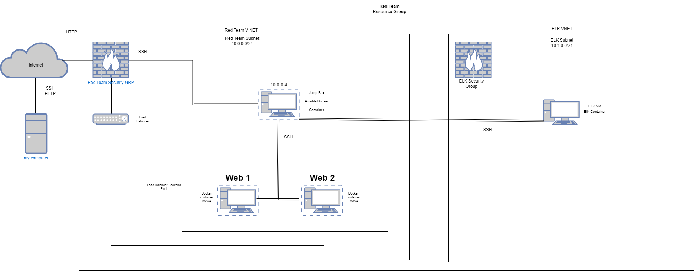

## Automated ELK Stack Deployment

The files in this repository were used to configure the network depicted below.

These files have been tested and used to generate a live ELK deployment on Azure. They can be used to either recreate the entire deployment pictured above. Alternatively, select portions of the YAML file may be used to install only certain pieces of it, such as Filebeat.

  - [Elk installation](https://github.com/Vadero66/Elk_stack_Project/blob/main/Ansible/install-elk.yml)
  - [Filebeat Installation](https://github.com/Vadero66/Elk_stack_Project/blob/main/Ansible/filebeat-playbook.yml)
  - [Metricbeat Installation](https://github.com/Vadero66/Elk_stack_Project/blob/main/Ansible/Metricbeat-Playbook.yml)

This document contains the following details:
- Description of the Topologu
- Access Policies
- ELK Configuration
  - Beats in Use
  - Machines Being Monitored
- How to Use the Ansible Build

### Description of the Topology

The main purpose of this network is to expose a load-balanced and monitored instance of DVWA, the D*mn Vulnerable Web Application.

Load balancing ensures that the application will be highly available, in addition to restricting access to the network.

- Load Balancers smartly distribute network traffic to make sure that no one server is overwhelmed. A Jumpbox allows you to quikly configure other machines from a single point.

Integrating an ELK server allows users to easily monitor the vulnerable VMs for changes to the logs and system metrics.
- Filebeat checks for changes in files and logs.
- Metricbeat checks for changes in system metrics.

The configuration details of each machine may be found below.

| Name     | Function | IP Address | Operating System |
|----------|----------|------------|------------------|
| Jump Box | Gateway  | 10.0.0.4   | Linux            |
| WEB1     | Web Server | 10.0.0.5 | Linux            |
| WEB2     | Web Server | 10.0.0.6 | Linux            |
| ELK      | Log Server | 10.1.04  | Linux            |

### Access Policies

The machines on the internal network are not exposed to the public Internet. 

Only the jumpbox machine can accept connections from the Internet. Access to this machine is only allowed from the following IP addresses:
- My Public IP address.

Machines within the network can only be accessed by the jumpbox.
- The machine that we allowed to access the ELK VM was the jumpbox 10.0.0.4

A summary of the access policies in place can be found in the table below.

| Name          | Publicly Accessible | Allowed IP Addresses |
|---------------|---------------------|----------------------|
| Jump Box      | Yes                 | Home IP              |
| Load Balancer | Yes                 | Open                 |
| ELK VM        | NO                  | 10.0.0.4             |
| WEB 1         | NO                  | 10.0.0.4             |
| WEB 2         | NO                  | 10.0.0.4             |

### Elk Configuration

Ansible was used to automate configuration of the ELK machine. No configuration was performed manually, which is advantageous because...
- Saves time and prevents human error during the configuration process. 

The playbook implements the following tasks:
- First task was to resize the virtual memory.
- Second task Installs Docker by using the APT module to install Docker.io
- Third task installs PIP using APT.
- Fourth task installs python3 using PIP
- Fifth task downloads and launches the ELK Container.
- Sixth task enables docker services.
- Seventh task starts docker services with systemd

The following screenshot displays the result of running `docker ps` after successfully configuring the ELK instance.

### Target Machines & Beats
This ELK server is configured to monitor the following machines:
- 10.0.0.5 and 10.0.0.6

We have installed the following Beats on these machines:
- We installed metrticbeat and filebeat on these machines.

These Beats allow us to collect the following information from each machine:
- Metricbeat moniotors system metrics. Filebeat collects information from logs and files.

### Using the Playbook
In order to use the playbook, you will need to have an Ansible control node already configured. Assuming you have such a control node provisioned: 

SSH into the control node and follow the steps below:
- Copy the playbook.yml file to etc/ansible Directory.
- Update the hosts file to include the IP addresses of the machines you want the playbook to run on. 
- Run the playbook, and navigate to the virtual macine thast the playbook was run on to check that the installation worked as expected.

- install-elk.yml is the file. We copy it to the etc/ansaible directory.
- The host file is updated to provide the specific IP addresses for each machine. By listing the IP addresses in the correct groups inside the hosts file. 
- http://ELK.VM.PUB.IP:5601/app/kibana is the website you go to in order to check that the beats are running. 

